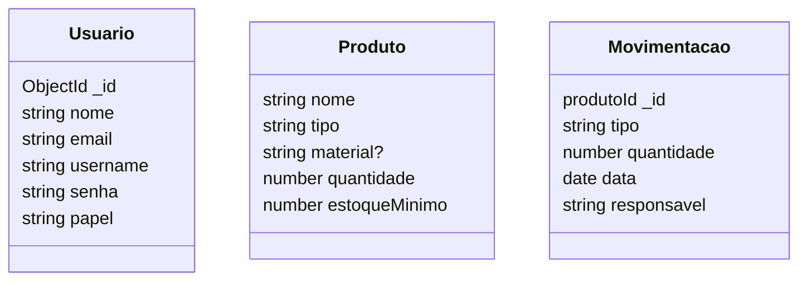

# Sistema de Gestão de Estoque (SGE)

## Briefing
O projeto consiste no desenvolvimento de um Sistema de Gestão de Estoque (SGE) no formato de uma aplicação web. O objetivo é organizar e otimizar o controle das atividades de entrada e saida de ferramentas e equipamentos de uma empresa. A plataforma permitirá o cadastro de produtos.

## Objetivo do Projeto
- gerenciar informações sobre equipamentos e manutenção realizadas pela empresa
- realizar abertura de chamados de manutenção (ordens de serviço)
- dashboard de históricos de manutenção

## Levantamento de Requistos do Projeto

## Requisitos Funcionais
### Requisitos Funcionais do Sistema de Gestão de Estoque (SGE)
- ### Autenticação e Navegação

- Identificação do Usuário: Exibir o nome do usuário ativo na interface.
- Logout: Permitir que o usuário saia da conta, redirecionando-o para a tela de login.
- Acesso às Funcionalidades: Disponibilizar links para as seções de cadastro de produtos e gestão de estoque na interface principal.

- ### Cadastro de Produtos

- Listagem de Produtos: Apresentar todos os produtos cadastrados em formato tabular.
- Busca de Produtos: Implementar campo de pesquisa por nome de produto.
- Cadastro de Novo Produto: Permitir inclusão de produtos com nome, descrição, quantidade inicial e quantidade mínima.
- Edição de Produto: Possibilitar a modificação dos dados de produtos existentes.
- Exclusão de Produto: Oferecer a opção de remoção de produtos do sistema.
- Validação de Dados: Garantir que campos obrigatórios sejam preenchidos e que os dados inseridos estejam no formato correto.
- Retorno à Tela Principal: Incluir botão para retorno à interface principal do sistema.

- ### Gestão de Estoque

- Ordenação Alfabética: Exibir os produtos em ordem alfabética.
- Seleção de Produto: Permitir que o usuário escolha um produto para movimentação.
- Tipo de Movimentação: Oferecer opções para registrar entrada ou saída de estoque.
- Data da Movimentação: Incluir campo para inserção da data da movimentação.
- Atualização Automática: Ajustar automaticamente a quantidade do produto após cada movimentação.
- Alerta de Estoque Mínimo: Emitir notificação quando a quantidade de um produto atingir o nível mínimo após saída.
- Histórico de Movimentações: Registrar informações sobre cada movimentação, incluindo responsável e data.

## Recursos do Projeto
- ### Tecnológicos
    - Framework de Desenvolvimento Next/React
    - Linguagem de Programação: TypeScript
    - Banco de Dados: Não Relacional (MongoDB)
    - GitHub
    - VsCode

- ### Versões
    - MongoDB: 8.19.2
    - Tipo: NOSQL
    - Funcionalidades utilizadas: Schermas, validações e agregações

- ### Linguagens Utilizadas
    - TypeScript versão 5.0 ou superior
    - Runtime: Node.js versão 18.0 ou superior
    - Framework: Next.js versão 15.5.3     
    - Bibliotecas principais:
    bcrypt: 6.0.0 (criptografia de senhas)
    jsonwebtoken: 9.0.2 (autenticação JWT)mongoose: 8.19.2 (ODM para MongoDB)react: 19.1.0 (interface do usuário)react-dom: 19.1.0 (renderização)5.1.3 
    
    ### Sistema Operacional
    Windows 11 (desenvolvimento)
    Compatibilidade: Windows 10+, Linux, macOS (produção)
    Shell padrão: CMD (Command Prompt)

- ### Pessoal
    - Dev Tudo

## Diagramas

1. ### Classe
Descrever o Comportamento das Entidades de um Projeto

    - Usuário (User/Usuario)
        - Atributos: id, nome, email, senha, papel
        - métodos: CRUD, login, logout

    - Produto (Product/Produto)
        - Atributos: nome, tipo, material, quantidade, estoqueMinimo
        - Métodos: CRUD
    
    - Movimentação (Movimentacao)
        - Atributos:  id, tipo, quantidade, data, responsavel



2.  Exemplos do Banco de Dados
### Criar usuários de exemplo
db.usuarios([
  {
    nome: "Pedro Souza",
    email: "pedrinho@empresa.com",
    username: "pedroo@empresa.com",
    senha: "$2a$10$encrypted_password_hash", // senha: "123456"
    tipo: "Administrador"
  },
]);

### Criar produtos de exemplo
db.produtos([
  {
    nome: "Machado",
    descricao: "Martelo profissional com cabeça de aço carbono e cabo de madeira",
    quantidade: 25,
    quantidadeMinima: 5
  }
]);

// Criar movimentações de exemplo
db.movimentacoes([
  {
    produtoId: ObjectId("produto_id_1"),
    tipo: "Entrada",
    quantidade: 20,
    data: new Date("2024-01-15"),
    usuarioId: ObjectId("usuario_id_1")
  }
]);

```
